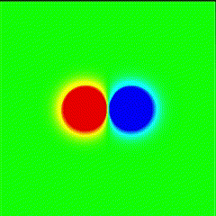
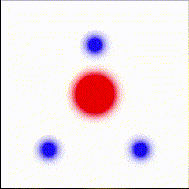

# Heat Transfer Visualization using CUDA & OpenGL

### Overview

This project implements a real-time 2D heat transfer simulation using CUDA and OpenGL

---

### Features

GPU-accelerated heat transfer simulation

CUDA-OpenGL interoperability for real-time rendering

Customizable simulation parameters and heat sources (heaters and coolers)

---

### Visualization

The simulation supports different heat source configurations. Below are examples of visual outputs generated by the program:

#### Example 1: 
Opposing Heat Sources

---

#### Example 2: 
Triangular Heater-Cooler Configuration

---
